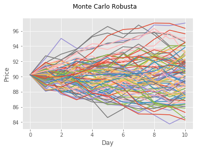

## Monte Carlo Simulation using the Robusta coffee price and other variables.

This code is about 100 times of the Monte Carlo Simulation using Robusta coffee spot price and other variables such as Arabica coffee price in Brazil, Brent crude oil, Inventories in certified storage, Absolute value of weather consition, and the forex rates of Brazil.

Some of Anaconda users may face the trouble with pandas_datareader. You can install following the link of official documents. https://media.readthedocs.org/pdf/pandas-datareader/stable/pandas-datareader.pdf


```python
import pandas_datareader.data as web
import pandas as pd
import datetime as dt
import numpy as np
import matplotlib.pyplot as plt
from matplotlib import style
```


```python
style.use('ggplot')
```

The step before doing Monte Carlo simulation was finding proper variables and periods.
My team chosen 6 variables and 180 days of time span using VAR(Vector AutoRegression) model.   
In this case, however, I am going to use only the price of Robusta coffee.


```python
test = pd.read_excel('new_daily4test_180.xlsx', index_col=0)
test.head()
```


<div>
<style scoped>
    .dataframe tbody tr th:only-of-type {
        vertical-align: middle;
    }

    .dataframe tbody tr th {
        vertical-align: top;
    }

    .dataframe thead th {
        text-align: right;
    }
</style>
<table border="1" class="dataframe">
  <thead>
    <tr style="text-align: right;">
      <th></th>
      <th>Robu_S</th>
      <th>Ara_Bra</th>
      <th>Brent</th>
      <th>C_Inven</th>
      <th>ABS1</th>
      <th>BRZCASHR</th>
    </tr>
    <tr>
      <th>Date</th>
      <th></th>
      <th></th>
      <th></th>
      <th></th>
      <th></th>
      <th></th>
    </tr>
  </thead>
  <tbody>
    <tr>
      <th>2017-05-18</th>
      <td>-0.009821</td>
      <td>-0.031773</td>
      <td>-0.000966</td>
      <td>0.000693</td>
      <td>0.644928</td>
      <td>0.072885</td>
    </tr>
    <tr>
      <th>2017-05-19</th>
      <td>0.002743</td>
      <td>0.025316</td>
      <td>0.020481</td>
      <td>0.003457</td>
      <td>0.644928</td>
      <td>-0.033804</td>
    </tr>
    <tr>
      <th>2017-05-22</th>
      <td>-0.027675</td>
      <td>-0.017064</td>
      <td>0.010742</td>
      <td>-0.000690</td>
      <td>0.644928</td>
      <td>0.003874</td>
    </tr>
    <tr>
      <th>2017-05-23</th>
      <td>0.007379</td>
      <td>0.003483</td>
      <td>-0.003004</td>
      <td>0.004823</td>
      <td>0.644928</td>
      <td>0.001439</td>
    </tr>
    <tr>
      <th>2017-05-24</th>
      <td>-0.015339</td>
      <td>-0.010094</td>
      <td>0.001878</td>
      <td>0.002060</td>
      <td>0.644928</td>
      <td>0.002263</td>
    </tr>
  </tbody>
</table>
</div>


The last day of Robusta price was 90.23


```python
last_Robu_s = 90.23
```

We are doing 100 times of Monte Carlo simulation for 10 days.


```python
# Setting number of simulations
num_simulations = 100
num_days = 10
```

Setting up model   
The mean value of the Robusta coffee price during 180 sample days has mean of -0.0002855759126066269 and the standard deviation of 0.010296159.


```python
simulation_df = pd.DataFrame()
simulation_return = pd.DataFrame()

Rob_series = []

for x in range(num_simulations):
    count = 0
    Rob_series = []
    Return_series = []
    Rob_series.append(last_Robu_s)
    
    for y in range(num_days):      
        if count == 251:
            break
        diff1 = (1+np.random.normal(-0.0002855759126066269, 0.010296159))
        Rob = Rob_series[count] * diff1
        Rob_series.append(Rob)
        Return_series.append(diff1)
        count += 1
        
    simulation_df[x] = Rob_series
    simulation_return[x] = Return_series
```

We can check the results of Monte Carlo simulations.


```python
simulation_return
```


<div>
<style scoped>
    .dataframe tbody tr th:only-of-type {
        vertical-align: middle;
    }

    .dataframe tbody tr th {
        vertical-align: top;
    }

    .dataframe thead th {
        text-align: right;
    }
</style>
<table border="1" class="dataframe">
  <thead>
    <tr style="text-align: right;">
      <th></th>
      <th>0</th>
      <th>1</th>
      <th>2</th>
      <th>3</th>
      <th>4</th>
      <th>5</th>
      <th>6</th>
      <th>7</th>
      <th>8</th>
      <th>9</th>
      <th>...</th>
      <th>90</th>
      <th>91</th>
      <th>92</th>
      <th>93</th>
      <th>94</th>
      <th>95</th>
      <th>96</th>
      <th>97</th>
      <th>98</th>
      <th>99</th>
    </tr>
  </thead>
  <tbody>
    <tr>
      <th>0</th>
      <td>0.991277</td>
      <td>0.990125</td>
      <td>0.975852</td>
      <td>1.006425</td>
      <td>0.991346</td>
      <td>0.991692</td>
      <td>1.002868</td>
      <td>1.003149</td>
      <td>0.989189</td>
      <td>1.024115</td>
      <td>...</td>
      <td>1.010744</td>
      <td>0.986092</td>
      <td>0.990743</td>
      <td>0.990229</td>
      <td>0.998387</td>
      <td>1.006768</td>
      <td>0.991280</td>
      <td>1.005839</td>
      <td>0.996549</td>
      <td>0.987808</td>
    </tr>
    <tr>
      <th>1</th>
      <td>1.008745</td>
      <td>1.006965</td>
      <td>1.006753</td>
      <td>1.000469</td>
      <td>1.013084</td>
      <td>0.986637</td>
      <td>0.988417</td>
      <td>1.006371</td>
      <td>1.000574</td>
      <td>1.028292</td>
      <td>...</td>
      <td>1.005504</td>
      <td>0.995889</td>
      <td>1.009990</td>
      <td>1.003587</td>
      <td>0.989070</td>
      <td>0.979730</td>
      <td>1.010913</td>
      <td>1.003429</td>
      <td>1.000597</td>
      <td>1.006530</td>
    </tr>
    <tr>
      <th>2</th>
      <td>0.996397</td>
      <td>1.001085</td>
      <td>0.996082</td>
      <td>1.009748</td>
      <td>0.977711</td>
      <td>1.001253</td>
      <td>0.997674</td>
      <td>1.004904</td>
      <td>0.997719</td>
      <td>0.986370</td>
      <td>...</td>
      <td>1.016176</td>
      <td>1.009387</td>
      <td>0.993971</td>
      <td>1.013866</td>
      <td>1.014652</td>
      <td>1.014100</td>
      <td>1.002966</td>
      <td>0.994647</td>
      <td>1.003935</td>
      <td>1.003482</td>
    </tr>
    <tr>
      <th>3</th>
      <td>1.016010</td>
      <td>1.009377</td>
      <td>0.998054</td>
      <td>1.006763</td>
      <td>0.999883</td>
      <td>1.012856</td>
      <td>0.996495</td>
      <td>0.999868</td>
      <td>0.994375</td>
      <td>1.000214</td>
      <td>...</td>
      <td>1.012087</td>
      <td>0.981897</td>
      <td>0.986650</td>
      <td>0.990603</td>
      <td>1.010126</td>
      <td>1.007220</td>
      <td>1.001650</td>
      <td>0.995614</td>
      <td>1.008610</td>
      <td>1.001566</td>
    </tr>
    <tr>
      <th>4</th>
      <td>1.001042</td>
      <td>0.996437</td>
      <td>0.995426</td>
      <td>1.005450</td>
      <td>1.000328</td>
      <td>1.004155</td>
      <td>1.002637</td>
      <td>0.992444</td>
      <td>0.992318</td>
      <td>1.005976</td>
      <td>...</td>
      <td>0.998654</td>
      <td>0.995921</td>
      <td>1.008688</td>
      <td>1.004396</td>
      <td>0.999450</td>
      <td>1.001075</td>
      <td>0.990622</td>
      <td>0.997588</td>
      <td>1.012273</td>
      <td>1.001385</td>
    </tr>
    <tr>
      <th>5</th>
      <td>0.993896</td>
      <td>0.984893</td>
      <td>1.008600</td>
      <td>1.003685</td>
      <td>0.989622</td>
      <td>0.998771</td>
      <td>1.000091</td>
      <td>1.002875</td>
      <td>1.005223</td>
      <td>1.004605</td>
      <td>...</td>
      <td>1.008627</td>
      <td>0.985079</td>
      <td>1.006720</td>
      <td>0.999660</td>
      <td>0.996541</td>
      <td>0.995508</td>
      <td>0.998035</td>
      <td>0.998867</td>
      <td>1.002930</td>
      <td>0.999884</td>
    </tr>
    <tr>
      <th>6</th>
      <td>0.993867</td>
      <td>1.008852</td>
      <td>1.032395</td>
      <td>0.980650</td>
      <td>0.995213</td>
      <td>0.995134</td>
      <td>0.991310</td>
      <td>1.002863</td>
      <td>1.009276</td>
      <td>1.001885</td>
      <td>...</td>
      <td>0.999374</td>
      <td>0.987326</td>
      <td>1.006636</td>
      <td>1.004095</td>
      <td>0.991010</td>
      <td>0.992533</td>
      <td>0.989404</td>
      <td>0.996885</td>
      <td>1.001721</td>
      <td>1.001401</td>
    </tr>
    <tr>
      <th>7</th>
      <td>1.002708</td>
      <td>1.012450</td>
      <td>0.985290</td>
      <td>0.996475</td>
      <td>1.001527</td>
      <td>1.017326</td>
      <td>1.013693</td>
      <td>0.986415</td>
      <td>0.999392</td>
      <td>1.019709</td>
      <td>...</td>
      <td>1.014625</td>
      <td>0.999690</td>
      <td>1.014919</td>
      <td>0.984125</td>
      <td>0.989790</td>
      <td>0.994184</td>
      <td>0.974946</td>
      <td>1.023822</td>
      <td>1.009243</td>
      <td>1.003304</td>
    </tr>
    <tr>
      <th>8</th>
      <td>0.992543</td>
      <td>1.000297</td>
      <td>1.019793</td>
      <td>1.004578</td>
      <td>0.992259</td>
      <td>0.995223</td>
      <td>1.003029</td>
      <td>1.004305</td>
      <td>0.999671</td>
      <td>0.999152</td>
      <td>...</td>
      <td>0.986110</td>
      <td>0.999130</td>
      <td>1.005462</td>
      <td>1.013092</td>
      <td>0.987488</td>
      <td>0.998367</td>
      <td>0.992807</td>
      <td>0.976831</td>
      <td>0.995223</td>
      <td>1.010044</td>
    </tr>
    <tr>
      <th>9</th>
      <td>1.010342</td>
      <td>0.987922</td>
      <td>1.011960</td>
      <td>0.998796</td>
      <td>1.008358</td>
      <td>1.005433</td>
      <td>1.003183</td>
      <td>1.001737</td>
      <td>0.994984</td>
      <td>1.003398</td>
      <td>...</td>
      <td>1.001017</td>
      <td>0.991969</td>
      <td>1.016013</td>
      <td>1.006392</td>
      <td>1.015799</td>
      <td>0.979810</td>
      <td>0.982183</td>
      <td>0.992024</td>
      <td>1.015545</td>
      <td>0.994381</td>
    </tr>
  </tbody>
</table>
<p>10 rows × 100 columns</p>
</div>


```python
simulation_df
```


<div>
<style scoped>
    .dataframe tbody tr th:only-of-type {
        vertical-align: middle;
    }

    .dataframe tbody tr th {
        vertical-align: top;
    }

    .dataframe thead th {
        text-align: right;
    }
</style>
<table border="1" class="dataframe">
  <thead>
    <tr style="text-align: right;">
      <th></th>
      <th>0</th>
      <th>1</th>
      <th>2</th>
      <th>3</th>
      <th>4</th>
      <th>5</th>
      <th>6</th>
      <th>7</th>
      <th>8</th>
      <th>9</th>
      <th>...</th>
      <th>90</th>
      <th>91</th>
      <th>92</th>
      <th>93</th>
      <th>94</th>
      <th>95</th>
      <th>96</th>
      <th>97</th>
      <th>98</th>
      <th>99</th>
    </tr>
  </thead>
  <tbody>
    <tr>
      <th>0</th>
      <td>90.230000</td>
      <td>90.230000</td>
      <td>90.230000</td>
      <td>90.230000</td>
      <td>90.230000</td>
      <td>90.230000</td>
      <td>90.230000</td>
      <td>90.230000</td>
      <td>90.230000</td>
      <td>90.230000</td>
      <td>...</td>
      <td>90.230000</td>
      <td>90.230000</td>
      <td>90.230000</td>
      <td>90.230000</td>
      <td>90.230000</td>
      <td>90.230000</td>
      <td>90.230000</td>
      <td>90.230000</td>
      <td>90.230000</td>
      <td>90.230000</td>
    </tr>
    <tr>
      <th>1</th>
      <td>89.442936</td>
      <td>89.339016</td>
      <td>88.051129</td>
      <td>90.809764</td>
      <td>89.449181</td>
      <td>89.480380</td>
      <td>90.488764</td>
      <td>90.514111</td>
      <td>89.254503</td>
      <td>92.405923</td>
      <td>...</td>
      <td>91.199472</td>
      <td>88.975077</td>
      <td>89.394731</td>
      <td>89.348401</td>
      <td>90.084420</td>
      <td>90.840661</td>
      <td>89.443149</td>
      <td>90.756838</td>
      <td>89.918612</td>
      <td>89.129906</td>
    </tr>
    <tr>
      <th>2</th>
      <td>90.225082</td>
      <td>89.961262</td>
      <td>88.645770</td>
      <td>90.852332</td>
      <td>90.619505</td>
      <td>88.284685</td>
      <td>89.440612</td>
      <td>91.090791</td>
      <td>89.305749</td>
      <td>95.020253</td>
      <td>...</td>
      <td>91.701474</td>
      <td>88.609326</td>
      <td>90.287820</td>
      <td>89.668894</td>
      <td>89.099813</td>
      <td>88.999276</td>
      <td>90.419241</td>
      <td>91.067999</td>
      <td>89.972253</td>
      <td>89.711949</td>
    </tr>
    <tr>
      <th>3</th>
      <td>89.899982</td>
      <td>90.058858</td>
      <td>88.298453</td>
      <td>91.737958</td>
      <td>88.599683</td>
      <td>88.395275</td>
      <td>89.232565</td>
      <td>91.537530</td>
      <td>89.102086</td>
      <td>93.725092</td>
      <td>...</td>
      <td>93.184795</td>
      <td>89.441084</td>
      <td>89.743435</td>
      <td>90.912250</td>
      <td>90.405267</td>
      <td>90.254159</td>
      <td>90.687411</td>
      <td>90.580500</td>
      <td>90.326320</td>
      <td>90.024318</td>
    </tr>
    <tr>
      <th>4</th>
      <td>91.339276</td>
      <td>90.903297</td>
      <td>88.126658</td>
      <td>92.358424</td>
      <td>88.589296</td>
      <td>89.531711</td>
      <td>88.919786</td>
      <td>91.525450</td>
      <td>88.600903</td>
      <td>93.745188</td>
      <td>...</td>
      <td>94.311097</td>
      <td>87.821904</td>
      <td>88.545347</td>
      <td>90.057948</td>
      <td>91.320725</td>
      <td>90.905783</td>
      <td>90.837026</td>
      <td>90.183244</td>
      <td>91.104058</td>
      <td>90.165319</td>
    </tr>
    <tr>
      <th>5</th>
      <td>91.434411</td>
      <td>90.579424</td>
      <td>87.723547</td>
      <td>92.861823</td>
      <td>88.618310</td>
      <td>89.903760</td>
      <td>89.154290</td>
      <td>90.833887</td>
      <td>87.920311</td>
      <td>94.305386</td>
      <td>...</td>
      <td>94.184127</td>
      <td>87.463645</td>
      <td>89.314599</td>
      <td>90.453820</td>
      <td>91.270490</td>
      <td>91.003492</td>
      <td>89.985154</td>
      <td>89.965758</td>
      <td>92.222154</td>
      <td>90.290173</td>
    </tr>
    <tr>
      <th>6</th>
      <td>90.876282</td>
      <td>89.211080</td>
      <td>88.477953</td>
      <td>93.204003</td>
      <td>87.698616</td>
      <td>89.793297</td>
      <td>89.162367</td>
      <td>91.095063</td>
      <td>88.379512</td>
      <td>94.739690</td>
      <td>...</td>
      <td>94.996663</td>
      <td>86.158630</td>
      <td>89.914773</td>
      <td>90.423060</td>
      <td>90.954808</td>
      <td>90.594708</td>
      <td>89.808350</td>
      <td>89.863845</td>
      <td>92.492373</td>
      <td>90.279670</td>
    </tr>
    <tr>
      <th>7</th>
      <td>90.318923</td>
      <td>90.000741</td>
      <td>91.344188</td>
      <td>91.400518</td>
      <td>87.278840</td>
      <td>89.356395</td>
      <td>88.387555</td>
      <td>91.355840</td>
      <td>89.199283</td>
      <td>94.918252</td>
      <td>...</td>
      <td>94.937151</td>
      <td>85.066615</td>
      <td>90.511420</td>
      <td>90.793355</td>
      <td>90.137149</td>
      <td>89.918281</td>
      <td>88.856761</td>
      <td>89.583877</td>
      <td>92.651564</td>
      <td>90.406166</td>
    </tr>
    <tr>
      <th>8</th>
      <td>90.563492</td>
      <td>91.121272</td>
      <td>90.000517</td>
      <td>91.078371</td>
      <td>87.412104</td>
      <td>90.904614</td>
      <td>89.597852</td>
      <td>90.114757</td>
      <td>89.145056</td>
      <td>96.788980</td>
      <td>...</td>
      <td>96.325616</td>
      <td>85.040206</td>
      <td>91.861733</td>
      <td>89.351985</td>
      <td>89.216814</td>
      <td>89.395342</td>
      <td>86.630517</td>
      <td>91.717935</td>
      <td>93.507958</td>
      <td>90.704842</td>
    </tr>
    <tr>
      <th>9</th>
      <td>89.888193</td>
      <td>91.148308</td>
      <td>91.781909</td>
      <td>91.495299</td>
      <td>86.735472</td>
      <td>90.470392</td>
      <td>89.869249</td>
      <td>90.502673</td>
      <td>89.115728</td>
      <td>96.706944</td>
      <td>...</td>
      <td>94.987699</td>
      <td>84.966178</td>
      <td>92.363486</td>
      <td>90.521800</td>
      <td>88.100568</td>
      <td>89.249387</td>
      <td>86.007362</td>
      <td>89.592896</td>
      <td>93.061239</td>
      <td>91.615841</td>
    </tr>
    <tr>
      <th>10</th>
      <td>90.817803</td>
      <td>90.047444</td>
      <td>92.879632</td>
      <td>91.385094</td>
      <td>87.460417</td>
      <td>90.961883</td>
      <td>90.155346</td>
      <td>90.659870</td>
      <td>88.668695</td>
      <td>97.035538</td>
      <td>...</td>
      <td>95.084314</td>
      <td>84.283854</td>
      <td>93.842466</td>
      <td>91.100450</td>
      <td>89.492488</td>
      <td>87.447439</td>
      <td>84.475007</td>
      <td>88.878316</td>
      <td>94.507838</td>
      <td>91.101052</td>
    </tr>
  </tbody>
</table>
<p>11 rows × 100 columns</p>
</div>


```python
fig = plt.figure()
fig.suptitle('Monte Carlo Robusta')
plt.plot(simulation_df)
plt.xlabel('Day')
plt.ylabel('Price')
plt.show()
```




